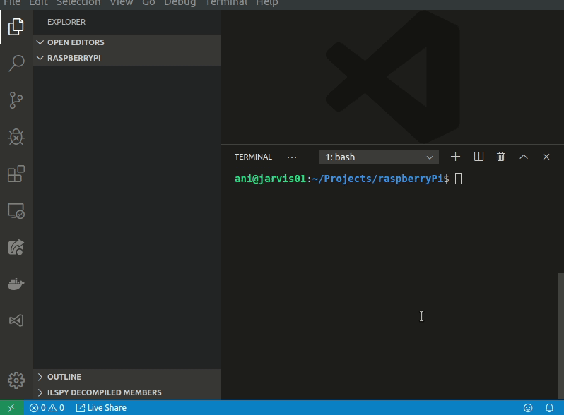

# devcontainer-tools

`devcontainer` is a .NET Core [global tool](https://docs.microsoft.com/en-us/dotnet/core/tools/global-tools) that creates and manages Visual Studio Code compatible [Remote Containers](https://code.visualstudio.com/docs/remote/containers) for development. To install, type

`sudo dotnet tool install --global devcontainer`

in your terminal.

Here's an example that shows how to use the [AWS template](https://github.com/aniongithub/devcontainer-tools/tree/master/devcontainer/templates/aws) to develop on an AWS instance with you local source code mounted on the remote machine and pass-through user permissions (no more `chown`ing files!)

Here's another example that uses the [SSH template](https://github.com/aniongithub/devcontainer-tools/tree/master/devcontainer/templates/ssh) in a local folder for live development on a Raspberry Pi

You can also use the [template `default`](https://github.com/aniongithub/devcontainer-tools/tree/master/devcontainer/templates/default) to set up local development. 

More information, templates and examples are coming! 